# Hi there, I'm Divyaksh Chachan! 👋

<div align="center">
  
</div>

<div align="center">
  
  
</div>

---

## 🚀 About Me

🎓 **3rd Year B.Tech in Artificial Intelligence** at **NIT Surat**  
💡 Passionate about leveraging AI to solve real-world problems and create meaningful impact through technology.

```python
class DivyakshChachan:
    def __init__(self):
        self.name = "Divyaksh Chachan"
        self.role = "AI Student"
        self.education = "3rd Year B.Tech AI - NIT Surat"
        self.location = "Surat, India"
        self.languages = ["Python", "C++", "JavaScript", "Java"]
        self.current_focus = [
            "Solving real-life problems using AI",
            "Software Development",
            "Building innovative solutions"
        ]
        self.learning = "Advanced Machine Learning & Full Stack Development"
    
    def say_hi(self):
        print("Thanks for dropping by! Let's connect and build something amazing together!")

me = DivyakshChachan()
me.say_hi()
```

---

## 🛠️ Tech Stack & Tools

<div align="center">

### 💻 Programming Languages


### 🌐 MERN Stack


### 🤖 AI/ML Libraries


### 🔧 Tools & Platforms


</div>

---

## 📊 GitHub Analytics

<div align="center">
  
  
</div>

<div align="center">
  
</div>

---

## ⚡ Coding Activity & Profiles

<div align="center">

### 🏆 Competitive Programming

[](https://leetcode.com/u/DivyakshChachan/)
[](https://codeforces.com/profile/layzcoder)

<div align="center">
  
</div>

</div>

### 📊 Weekly Coding Activity

<!--START_SECTION:waka-->
**📊 This Week I Spent My Time On:**

```text
Python       12 hrs 30 mins  ████████████░░░░░░░░░░░░░   50.2%
C++          8 hrs 15 mins   ████████░░░░░░░░░░░░░░░░░   33.1%
JavaScript   3 hrs 45 mins   ███░░░░░░░░░░░░░░░░░░░░░░   15.1%
Java         2 hrs 20 mins   ██░░░░░░░░░░░░░░░░░░░░░░░    9.4%
HTML/CSS     1 hr 30 mins    █░░░░░░░░░░░░░░░░░░░░░░░░    6.0%
```

**🔥 Editors:**
```text
VS Code      20 hrs 30 mins  ████████████████████░░░░░   82.4%
Jupyter      4 hrs 20 mins   ████░░░░░░░░░░░░░░░░░░░░░   17.6%
```

**💻 Operating System:**
```text
Windows      24 hrs 50 mins  █████████████████████████   100.0%
```
<!--END_SECTION:waka-->

---

## 🎯 Current Focus

```mermaid
graph TD
    A[🤖 AI Solutions] --> B[Real-world Problems]
    A --> C[Machine Learning Models]
    D[💻 Software Development] --> E[MERN Stack Apps]
    D --> F[Full Stack Solutions]
    B --> G[🌟 Innovation]
    C --> G
    E --> G
    F --> G
```

<div align="center">



</div>

- 🔬 **AI Research**: Developing machine learning solutions for real-world challenges
- 💡 **Problem Solving**: Creating innovative software solutions using AI
- 🚀 **Full Stack Development**: Building scalable web applications with MERN stack
- 📚 **Continuous Learning**: Exploring advanced AI concepts and emerging technologies

---

## 🏆 GitHub Trophies

<div align="center">
  
</div>

---

## 📈 Contribution Graph

<div align="center">
  
</div>

---

## 🌟 Featured Projects

<div align="center">
  <a href="https://github.com/DivyakshChachan/project1">
    
  </a>
  <a href="https://github.com/DivyakshChachan/project2">
    
  </a>
</div>

---

## 🤝 Let's Connect!

<div align="center">
  
[](https://www.linkedin.com/in/divyaksh-chachan/)
[](https://divyakshchachan.com)
[](https://leetcode.com/u/DivyakshChachan/)
[](https://codeforces.com/profile/layzcoder)
[](mailto:contact@divyakshchachan.com)
[](https://github.com/DivyakshChachan)

</div>

---

<div align="center">
  
</div>

<div align="center">
  
**Thanks for visiting! 😊**

*"The best way to predict the future is to create it." - Peter Drucker*

</div>

---

<div align="center">
  
</div>
